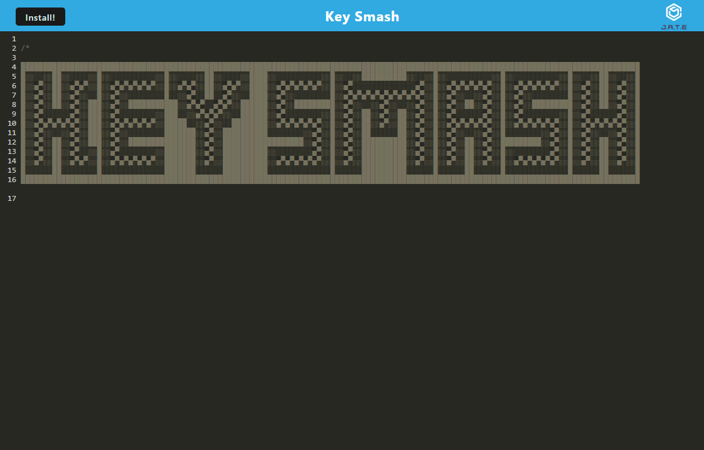

# Key Smash
  

  
## Description

Key Smash is a text editor available for use with or without an internet connection. It was created for the educational purpose of implementing a Progressive Web Application for a Coding Bootcamp. Starter code was provided for the application itself. Turning it into a PWA was the assignment carried out by the publisher.

## Table of Contents

- [Installation](#installation)
- [Usage](#usage)
- [Credits](#credits)
- [Features](#features)
- [Contribute](#contribute)
- [Tests](#tests)
- [Questions](#questions)
- [License](#license)

## Installation

Visit key-smashr.herokuapp.com for the application. No further steps are needed to use it in the browser. If you wish to use it outside the browser, visit the aforementioned link and click install. An icon should be added to your desktop.

## Usage

Writing code. Saving code. Editing code.

## Credits

Collaborators
- N/A

Third Party Assets
- N/A

Tutorials
- N/A

## Features

- Edit text. Save in browser storage. Download to use offline.

## How to Contribute

N/A
  
## Tests

N/A

## Questions

Any questions? Contact me at:
- E-mail: joechristiansonwebdev@gmail.com
- GitHub: github.com/JoeChristianson
- Other means: N/A

## License

This app is covered by the MIT license. For more information, visit https://opensource.org/licenses/Apache-2.0.

## Live Link

www.key-smashr.herokuapp.com
